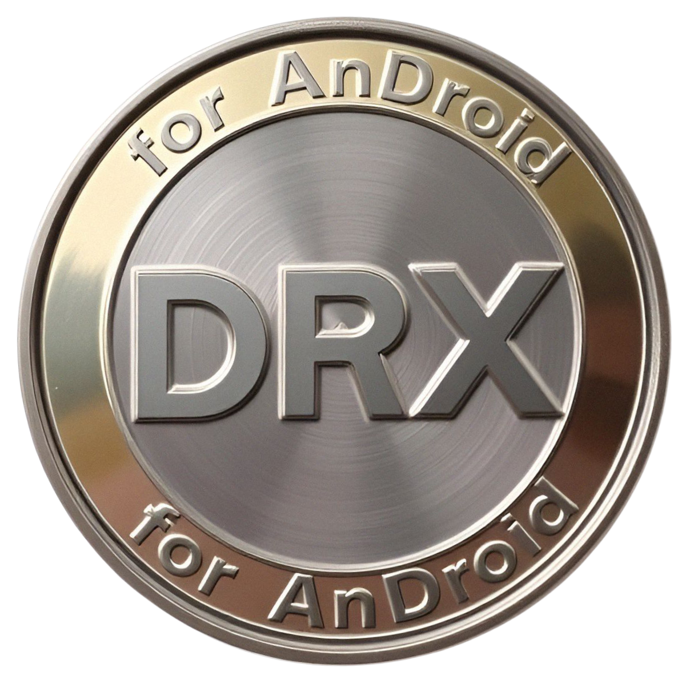

# Droid (DRX)

## Obsah
- [Úvod](#úvod)
- [Motivace](#motivace)
- [Technické specifikace](#technické-specifikace)
- [Upozornění](#upozornění)
- [Instalace](#instalace)
- [Dokumentace](#dokumentace)
- [Licence](#licence)
- [Autor](#autor)

## Úvod

Droid (DRX) je experimentální kryptoměna navržená pro Android zařízení. Aktuální verze je v rané fázi vývoje (Alpha) a není určena pro produkční použití.

Tato kryptoměna je inspirovaná Bitcoinem a Ethereem, i když je blíže staršímu Ethereu, které používalo konsenzuální mechanismus Proof-of-Work, jenž byl postupem času vytlačen konsenzuálním mechanismem Proof-of-Stake.

## Motivace

- **Decentralizace:** každý uživatel je zároveň těžař i full node.
- **Dostupnost:** těžba dostupná každému s Android zařízením.
- **Ekologie:** nízká energetická náročnost oproti ASIC.
- **Svoboda:** žádné KYC, žádná třetí strana.

## Technické specifikace

- **Tokenomika:** [WHITEPAPER.md](WHITEPAPER.md)
- **Síť a P2P:** podrobně popsáno v [WHITEPAPER.md](WHITEPAPER.md)
- **Kryptografie a transakce:** [WHITEPAPER.md](WHITEPAPER.md)

## Upozornění ⚠️

Projekt je ve fázi Alpha a **není určen pro produkční použití**. V současné fázi doporučuji používat VPN Tailscale, nebo ZeroTierOne pro bezpečný provoz. Alternativně můžete použít SSH.

## Instalace

- [INSTALLATION.md](INSTALLATION.md)

## Dokumentace

- [WHITEPAPER.md](WHITEPAPER.md)
- [CONTRIBUTING.md](CONTRIBUTING.md)

## Licence

Tento projekt je pod **MIT licencí**. Více info: [LICENSE](LICENSE), [TRADEMARK.md](TRADEMARK.md)

## Copyright (c) 2026 DarkwalkerPrime
